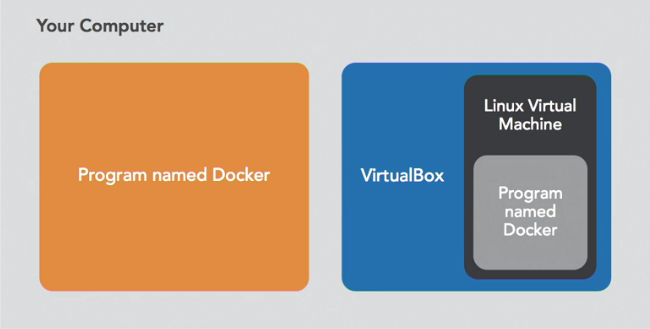
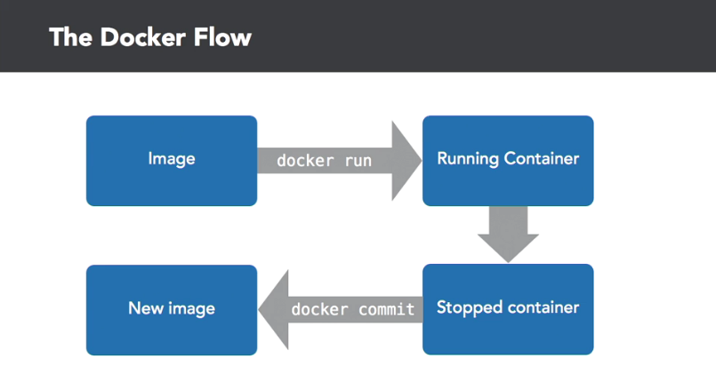

# Necessary Docker Commands
* How docker works:

    

* Docker workflow:

    

* To get a remote image and run it's bash:
    ```
    docker run -ti debian bash
    ```
    `docker run`: The docker command
    
    ```ti```: terminal interactive
    
    `debian`: name of the docker image

* To get all the docker images list:
    ```
    docker images
    ```
* To see all containers:
    ```
    docker ps -a
    ```
* To see the last stopped container
    ```
    docker ps -l
    ```
* To create an image from the existing container
    * `Long step`:
        * Get the container ID from the command
            ```
            docker ps -l
            ```
        * Build an image from there
            ```
            docker commit <container-id>
            ```
            This will return an image ID

        * Set a name for the image
            ```
            docker tag <image-id> your-image-name
            ```
    * `Short Step`:

        * Get the container ID
            ```
            docker ps -l
            ```
        * Build an image from the and name it at the same time
            ```
            docker commit <container-id> your-image-name
            ```
* Processes:
    * If we want to create a container which we will delete after the process finished:
        ```
        docker run --rm ubuntu sleep 5
        ```

        To make things more understandable
        ```
        docker run --rm ubuntu bash -c "sleep 3; echo container killed"
        ```

        When you go inside of the container you can exit by typing `Ctrl+p` and then `Ctrl+q`. That will detouch you from the container but keep the container alive.


``Notes``:

* Every time we create a container from the image the container will be different from the other containers.
* To run the terminal interactively (if we want to use tabs for suggestions we can use `-ti`)

